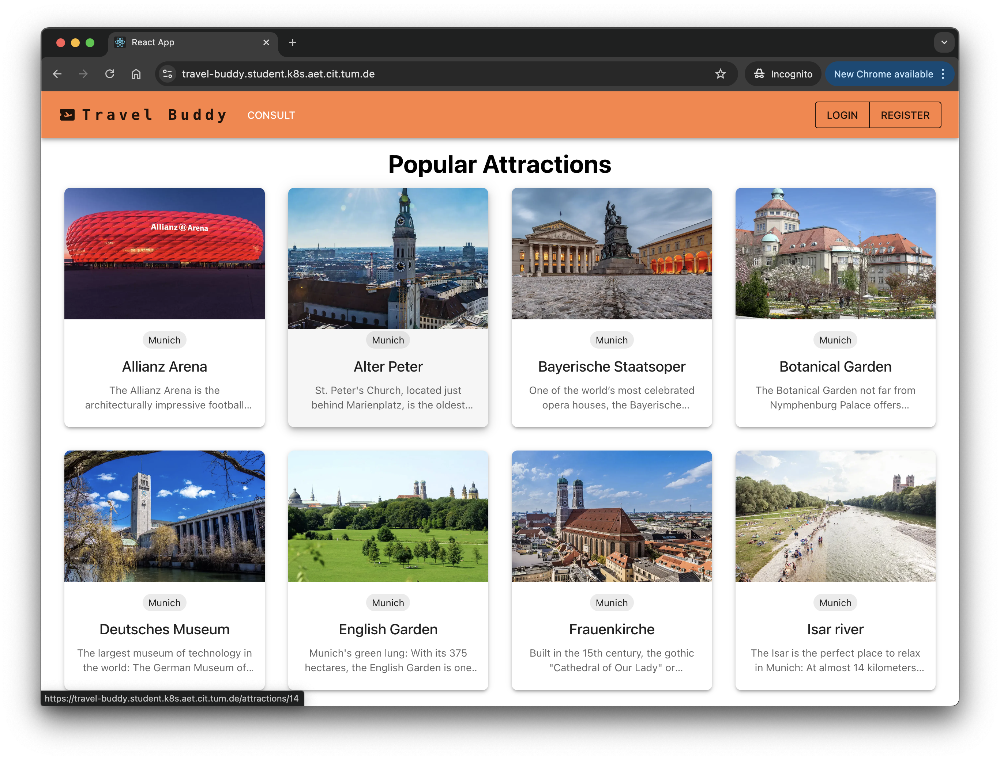
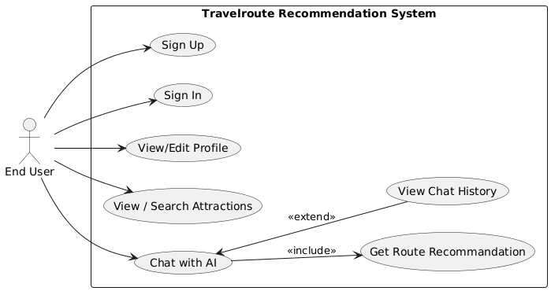
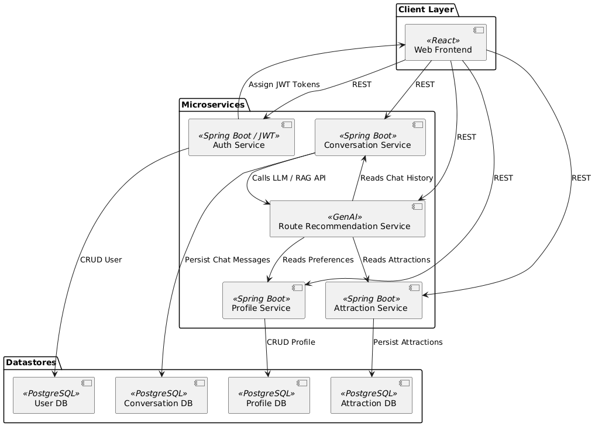

# GenAI Route Recommendation for Travel



This repository contains the source code and documentation for a GenAI-powered web application designed to deliver personalized travel itineraries using conversational AI to provide personalized attraction recommendation.

## Overview

Travel planning can be complex and tedious. This project addresses the issue by creating highly personalized itineraries, optimizing according to multiple user preferences, and offering real-time, reliable recommendations via AI.



### Intended Users

* **Independent Travelers** seeking personalized travel routes.
* **Industry Partners** (such as Ticket Booking Platforms) aiming to enhance their services with personalized route planning.

## Main Functionalities

### 1. Conversational Trip Builder

Interact naturally with an AI assistant to generate customized travel routes. Example:

* User input: "I have 5 days in Munich, architect fan and want to explore authentic local restaurants."
* Output: Personalized travel recommendation with explanation.

### 2. Preference-Aware Optimization

Routes are optimized based on user-defined preferences such as budget, scenic value, and accessibility. Preferences are persistently stored for continuous improvement over multiple sessions.

### 3. Reliable Recommendations

The system employs Retrieval-Augmented Generation (RAG) to recommend real-world attractions backed by current and verified information from reliable sources.

## System Architecture

* **Client Side:** Built with React.js, interacts with users via intuitive conversational UI.
* **Server Side:** Spring Boot for core business logic.
* **AI Components:** GenAI model (LLMs with RAG integration) for conversational reasoning and recommendations.
* **Persistence Layer:** PostgreSQL database for storing user preferences and session data.



## Installation and Setup

### Prerequisites

* Java 21
* Node.js 18 or higher
* PostgreSQL
* Docker (optional but recommended)

### Steps

### Docker Setup (recommended)

1. **Clone Repository**

   ```sh
   git clone git@github.com:AET-DevOps25/team-drop-database.git
   ```
   
2. **Build and Run Docker Containers**

   enter the path where you cloned the repository

   ```sh
   ./start-docker-all.sh
   ```

### Development Setup

1. **Clone Repository**

   ```sh
   git clone git@github.com:AET-DevOps25/team-drop-database.git
   ```

2. **Server Side Setup**

   ```sh
   cd server/AttractionService
   ./gradlew build
   ```

   ```sh
   cd server/AuthService
   ./gradlew build
   ```

   ```sh
   cd server/UserService
   ./gradlew build
   ```
   before running the microservices, make sure to set up the PostgreSQL database and update the `application.properties` files with your database credentials.
   you should also specify the profile to be "dev"

3. **Frontend Setup**

   ```sh
   cd frontend
   npm install
   npm start
   ```

## Usage

* Access the application via `http://localhost:3000` or under `https://travel-buddy.student.k8s.aet.cit.tum.de/`
* Begin by providing preferences or directly interacting with the conversational AI.

## Student Responsibilities

| Student Name  | Responsibility                                                                                                                        |
|---------------|---------------------------------------------------------------------------------------------------------------------------------------|
| Shuaiwei Yu   | 1. AuthService Implementation <br/> 2. Client Side Authentication & Conservation Page Implementation <br/> 3. Helm and K8S deployment |
| Haochuan Huai |                                                                                                 |
| Zhiyuan Ni    |                                                                                         |

## Documentation

Additional detailed documentation, architectural diagrams, and API specifications can be found in the project’s [Confluence page](confluence-url).
